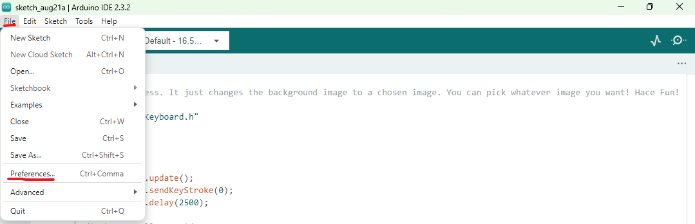
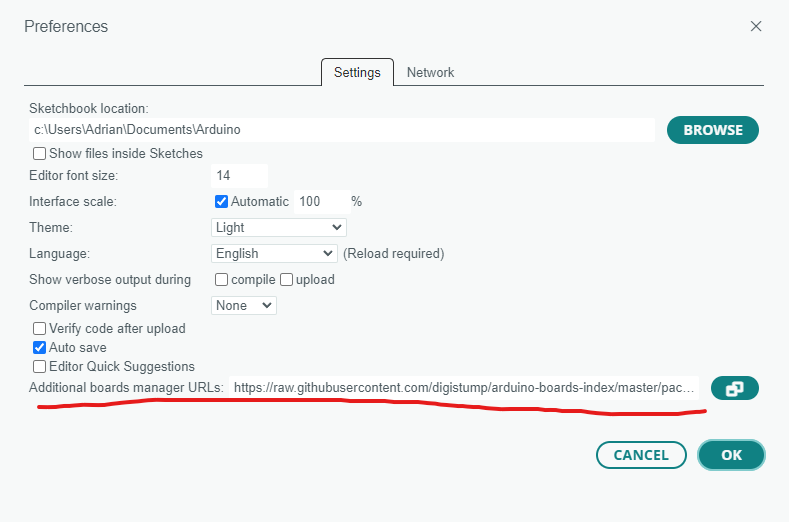
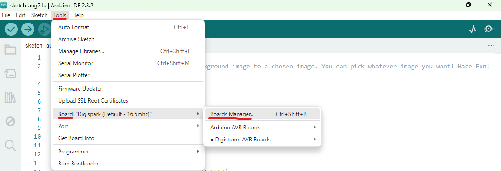
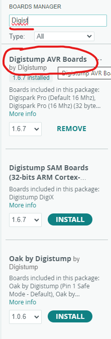

# The Bad USB Framework

## Project is EOL

Thanks for the support to whoever starred this repository. I am officially closing this project. It will see a few clean ups here and there in the next few days, but once that's done, it's all done. You will still be able to use the framework and I don't foresee it being obsolete any time soon.

## DISCLAIMER

This framework guide is intended for **educational purposes only!** Malicious use of this framework is **NOT** endorsed and is illegal. If you wish to perform of the actions shown on property that you do not own, ensure you have prior approval from the rightful owner.

Remember: **Hack Responsibly.**

> Most of the payloads and scripts were not made by me. This is a collection of my favorite scripts out there and modified to suit this framework. To see the original creators, head over to the `Credits` section of this documentation.

## About The Framework

This framework is your one-stop-shop to get you up and running to create malicious USBs.

This guide will walk you through on setting up and creating your very own USB using the `ATTiny85 Micro Controller`. At the end of the document, I will detail a phishing campaign you can set up using the provided script `The-Go-To.ino`. This is my personal favorite for demonstrations. I will not be guiding you on how to set it up as I feel it is your own duty to be ready and knowledgeable to take on the responsibility.

## Pre-Requisites

You will need the following:

1. ATTiny85 Micro Controller USB Device (You can purchase one online for cheap or make your own. There are countless sellers and tutorials out there)
2. Fundamentals of [Networking](https://www.netacad.com/courses/networking-basics), USB, [Computers](https://edu.gcfglobal.org/en/computerbasics/what-is-a-computer/1/), [Powershell](https://blog.netwrix.com/powershell-scripting-tutorial/), [Bash](https://www.freecodecamp.org/news/bash-scripting-tutorial-linux-shell-script-and-command-line-for-beginners/), and [Ethical and Responsible Hacking](https://www.eccouncil.org/cybersecurity-exchange/ethical-hacking/what-is-ethical-hacking/)
   1. **DO NOT SKIP THIS!** This will help you with troubleshooting and practicing safe ethical hacking. We are not here to build script-kiddies, but smart and responsible hackers. 
   2. If you get stuck and come to me with *"uHhh tHerE iS aN iSSuE"*, I will know you didn't get the fundamentals down and I will not tolerate such behavior.

## Setting Up your PC

Firstly, we will set up your PC to program your ATTiny85.

1. Download the latest version of [Arduino IDE](https://docs.arduino.cc/software/ide/).
   1. **WINDOWS ONLY!** - Download and install the latest [Digistump Arduino Driver Release](https://github.com/digistump/DigistumpArduino/releases) by running `Install Drivers.exe` after installing Arduino IDE.
2. After install, go to `File > Preferences` and under `Additional boards manager URLs` insert the following URL: `https://raw.githubusercontent.com/0xnarwhal/BadUSB/refs/heads/main/package_digistump_index.json`. If the link no longer works for some reason, I have included the file in this repository. If you can't troubleshoot something like this, please educate yourself first before continuing.
   1. 
   2. 
   3. > NOTE: If there is already a URL, you can insert multiple URLs by separating them with a semi-colon `;`.
3. Under `Tools > Board: > Board Manager`, select `Digistump AVR Boards` and install.
   1. 
   2. 
4. You're ready to program your ATTiny85!

## A Simple Prank: Changing the Wallpaper

Now we can focus on programming your malicious USB. Back to your personal computer, under the `scripts\` folder, it contains various Arduino scripts to get you started on your journey of programming bad USBs. For the sake of simplicity, we will be using `Wallpaper_Change.ino` file. It is a script sequence change the current wallpaper to another of our own choosing.

1. To begin, select the correct board by selecting `Tools > Board > Digistump AVR Boards > Digispark (Default - 16.5mhz)`.
2. Copy and paste the script into the Arduino IDE.
   1. You can change the URL where the image will be downloaded from if you'd like.
3. Then click `Upload` and once prompted to plug in the USB, do so. It should take at most 5 seconds to program. Once done, remove the USB.
4. Now it is primed to be used at your own discretion. All you have to do is plug it in to your victim's machine.

## The Attack

Just plug it in and watch the magic.

## Moving On

This is just the start for you. Go crazy. But remember: **Hack Responsibly**. Educate yourself first before attempting anything. If you don't understand what you are doing or why you're doing it, stop and learn. It is also good practice for anything in the future.

### Advanced Project

Have a look at the `The-Go-To.ino` script. It is my favorite demonstration to show how devastating this USB can be. I am not going to show you how to do it. You will have to learn the following to make it make any remote sense and understand what it does. Only then, should you be able to set the project up yourself.

#### Things to Study

1. [Ethical and Responsible Hacking](https://www.eccouncil.org/cybersecurity-exchange/ethical-hacking/what-is-ethical-hacking/)
2. [USB Protocol](https://www.beyondlogic.org/usbnutshell/usb1.shtml)
3. [IP Addresses](https://whatismyipaddress.com/ip-basics) and [Ports](https://www.cloudflare.com/learning/network-layer/what-is-a-computer-port/)
4. [Networking](https://www.netacad.com/courses/networking-basics?courseLang=en-US)
5. [HTTP & HTTPS](https://izooto.com/blog/understanding-http-https-protocols)
6. [Shells](https://www.shellscript.sh/)
   1. [Netcat & Reverse Shells](https://www.hackingtutorials.org/networking/hacking-with-netcat-part-1-the-basics/)
7. [SSH](https://www.digitalocean.com/community/tutorials/ssh-essentials-working-with-ssh-servers-clients-and-keys)
8. [Servers](https://www.spiceworks.com/tech/tech-general/articles/what-is-a-server/)
   1. [File Servers](https://www.techtarget.com/searchnetworking/definition/file-server)
9. [Encoding and Decoding](https://medium.com/@pratiyush1/understanding-different-types-of-encoding-and-decoding-in-programming-with-practical-examples-dcbdd5215605)
   1. [Base64](https://builtin.com/software-engineering-perspectives/base64-encoding)

**DO NOT SKIP THIS!**

I went through all that trouble on providing free resources, the least you could do is read and understand. Also, they are hints on how to set up the project.

Have fun suckers.

\- *narwhal*

## Credits

[AFNordal - Persistant Reverse Shell](https://github.com/AFNordal/powershell_reverseTCPshell)

[CedArctic - Various DigitSpark Scripts](https://github.com/CedArctic/DigiSpark-Scripts)
